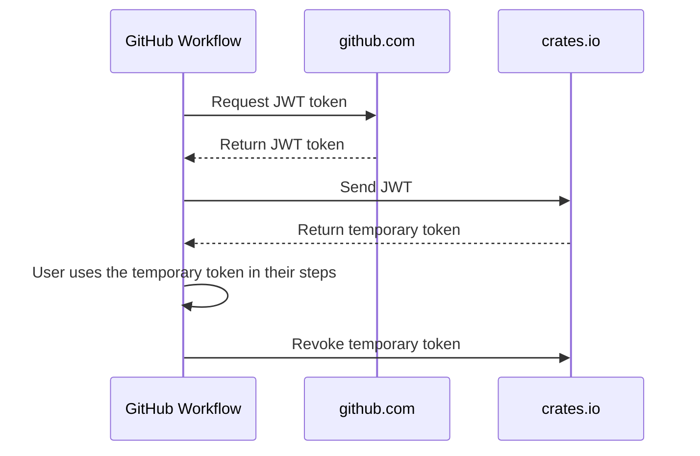

# trusted-publishing-action-draft

Get a temporary access token that you can use to interact with crates.io.

Remember:

- You must have configured your crate
- You already published the first version of your crate (todo: is this only true now and will be fixed eventually?)

You can read the token from the actions output `token` and use it in the subsequent steps.

The `post` step of the action will revoke the token, so that it cannot be used after the job is done.

## Usage

```yaml
name: Publish Crate

on:
  tag:

jobs:
  publish:
    runs-on: ubuntu-latest

    # Required for OpenID Connect token retrieval
    permissions:
      id-token: write

    steps:
      - name: Checkout code
        uses: actions/checkout@v4

      - name: Authenticate with crates.io
        id: auth
        uses: rust-lang/crates-io-auth-action@v1

      - name: Publish to crates.io
        run: cargo publish
        env:
          CARGO_REGISTRY_TOKEN: ${{ steps.auth.outputs.token }}
```

### Specify a different registry

If you want to use a different registry than crates.io, you can specify the
registry URL in the `url` input:

```yaml
- name: Authenticate with custom registry
  id: auth
  uses: rust-lang/crates-io-auth-action@v1
  with:
    url: my-registry.example.com
```

Note that the registry must support OpenID Connect authentication.

## Sequence Diagram



## TODO

- [ ] automate tag update (e.g. v1 updates when v1.0.1 is released)
- [ ] add retry logic?
- [ ] write more docs or link to more docs
- [ ] add license
- [ ] configure automatic dependencies updates (renovate or dependabot)
- [ ] add integration tests with snapshots to test error cases
- [ ] add unit tests to test functions
- [ ] new test in github actions where we test if permission is missing.
- [ ] write author in action.yml
- [ ] fix warnings when running `npm run package`
